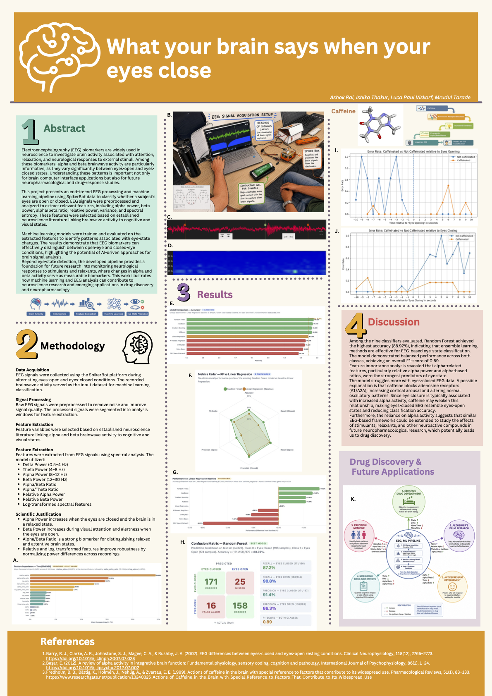

# EEG Eye State Classification using Machine Learning

## Project Overview

This project develops a machine learning pipeline for **EEG Eye State Classification**, where the objective is to predict whether a subject's eyes are **Open** or **Closed** based on electroencephalography (EEG) recordings.

The project follows a complete machine learning workflow, including data preprocessing, feature extraction, model training, hyperparameter optimization, and performance evaluation.

---
### Project Poster

### Project Poster



# Dataset

The dataset consists of EEG recordings collected from multiple electrodes positioned on the scalp.

Each observation represents a short EEG recording described by numerical signal features and is labelled as:

* **0** – Eyes Open
* **1** – Eyes Closed

---


# Project Pipeline

## 1. Data Loading

* Load the EEG dataset
* Inspect dataset dimensions
* Check data types
* Verify class distribution
* Identify missing values and duplicates

---

## 2. Data Preprocessing

The preprocessing stage prepares the data for machine learning.

Steps include:

* Handling missing values (if present)
* Removing duplicate records
* Separating features and target labels
* Feature scaling using StandardScaler
* Train-test split

---

## 3. Feature Engineering

Feature preparation includes:

* Standardization of numerical EEG features
* Preparing input matrices for model training
* Maintaining reproducible preprocessing pipeline

---

## 4. Machine Learning Models

Multiple supervised learning algorithms were trained and compared.

Models evaluated include:

* Logistic Regression
* Support Vector Machine (SVM)
* Random Forest
* Decision Tree
* K-Nearest Neighbours (KNN)

---

## 5. Hyperparameter Tuning

To improve model performance, hyperparameter optimization was performed using:

* Grid Search Cross Validation

The best parameter combination was selected based on cross-validation performance.

---

## 6. Model Evaluation

Each model was evaluated using several classification metrics:

* Accuracy
* Precision
* Recall
* F1-score
* Confusion Matrix
* Classification Report

Performance comparisons were made to identify the best-performing classifier.

---

## 7. Final Model

The best-performing model from the evaluation stage was selected as the final classifier.

The trained pipeline can be used to predict eye state for unseen EEG recordings after applying the same preprocessing steps.

---

# Project Structure

```text
EEG-Eye-State-Classification/
│
├── data/
│   └── eeg_eye_state.csv
│
├── notebooks/
│   └── Final_Pipeline.ipynb
│
├── models/
│   └── trained_model.pkl
│
├── README.md
└── requirements.txt
```

*(Modify the folder names above if your repository structure differs.)*

---

# Technologies Used

* Python
* Pandas
* NumPy
* Scikit-learn
* Matplotlib
* Seaborn
* Jupyter Notebook

---

# Workflow Summary

```text
Load Dataset
      │
      ▼
Data Cleaning
      │
      ▼
Feature Scaling
      │
      ▼
Train/Test Split
      │
      ▼
Model Training
      │
      ▼
Hyperparameter Tuning
      │
      ▼
Model Evaluation
      │
      ▼
Best Model Selection
      │
      ▼
Prediction
```

---

# Results

The project compares multiple machine learning algorithms for EEG eye state prediction and selects the best-performing model based on objective evaluation metrics. The resulting pipeline demonstrates how EEG signals can be processed and classified effectively using supervised learning techniques.

---

# Future Improvements

Possible extensions include:

* Deep learning models (CNNs/LSTMs)
* Real-time EEG stream classification
* Advanced feature extraction in the frequency domain
* Explainable AI (SHAP/LIME)
* Deployment as a web application using Streamlit or Flask

---

# Authors

Developed as part of an Artificial Intelligence / Data Science academic project.

